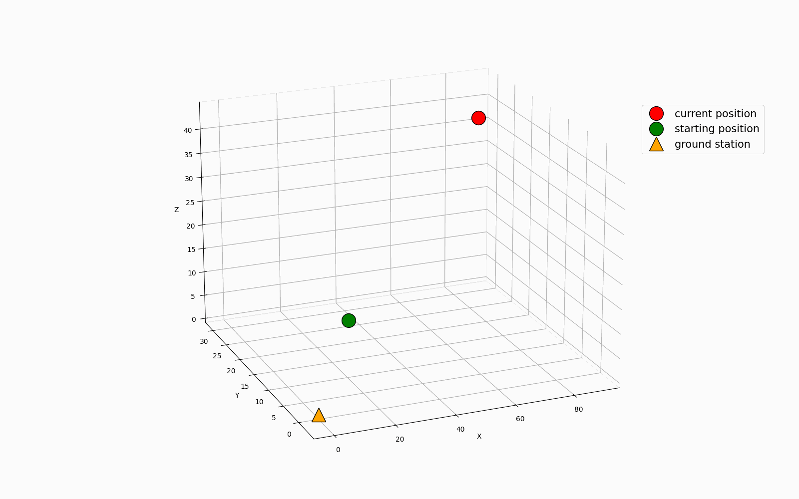

# RL for airborne wind power generation

This repository contains the code used to control by means of model-free Reinforcement Learning an airborne wind energy system used for electric energy production. The physical model is based on the "yo-yo configuration" proposed by [Canale et al., 2009](https://ieeexplore.ieee.org/abstract/document/5152910).

First of all, the `C++` environment `libkite.so` has to be compiled, by executing the command:

```makefile
make x86 #to compile on standard x86 systems

make m1 #to compile on Apple silicon macs

make parallel #to enable parallel loading of turbulent flow data (on x86 only)
```

Learning can be performed by running the command:

```
python run.py
```

The specifications of the learning process are enforced by using input parameters:

- `alg`: RL algorithm to be used, either `sarsa `or `dql`;
- `path`: Path where to store learning outputs;
- `wind`: Kind of wind pattern to use, either `const` or `lin` or `turbo`;
- `episodes` and `duration`: Number of learning episodes and maximum duration of each episode (in seconds);
- `lr` and `eps`: Initial learning rate and initial exploration rate;
- `lrstart`and `epsstart`: learning step when to start learning rate and exploration rate decay;
- `lrrate` and `epsrate`: exponents for the aforementioned decay, shaped as a power law.

Constant and linear wind patterns are generated algorithmically on-the-go, while the turbulent flow data (~14GB) can be downloaded by typing the following command in the `env` folder:

```
wget --load-cookies /tmp/cookies.txt "https://docs.google.com/uc?export=download&confirm=$(wget --quiet --save-cookies /tmp/cookies.txt --keep-session-cookies --no-check-certificate 'https://docs.google.com/uc?export=download&id=15u4cvvwuiFLsNw6VlbYSLADoMQReszOn' -O- | sed -rn 's/.*confirm=([0-9A-Za-z_]+).*/\1\n/p')&id=15u4cvvwuiFLsNw6VlbYSLADoMQReszOn" -O flow.tgz && rm -rf /tmp/cookies.txt
```

After successfully completing a learning process, one can evaluate the learned policy by running:

```
python eval.py
```

With similar parameters as the other script.

### Examples of learning results in the turbulent flow

Example of a kite trajectory in the turbulent Couette flow:

```
python run.py --alg=sarsa --wind=turbo --episodes=50000 --eval_episodes=1000  --lr=0.1 --lrstart=1000000 --epsstart=1200000 --path=./results/turbo/
```




Authors:

- [Lorenzo Basile](https://github.com/lorenzobasile)
- [Claudio Leone](https://github.com/LionClaude)

Project developed in the group of prof. Antonio Celani (QLS@ICTP, Trieste)
